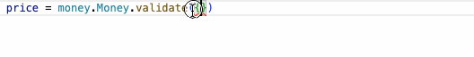
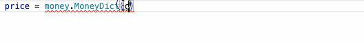
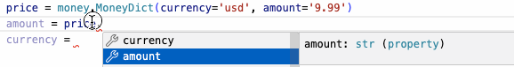

# OpenAPI JSON Schema Generator

[](https://dl.circleci.com/status-badge/redirect/gh/openapi-json-schema-tools/openapi-json-schema-generator/tree/master)
[](./LICENSE)

Auto generate a client sdk from your openapi 3.0.0-3.1.0 document using Openapi JSON Schema Generator. 
This project is a code generator that focuses on supporting all openapi and json schema features.

## Overview
OpenAPI JSON Schema Generator allows auto-generation of API client libraries (SDK generation) given an
[OpenAPI Spec](https://github.com/OAI/OpenAPI-Specification) (3.0.0-[3.1.0*](#preliminary-310-spec-support) are supported).
This project focuses on making the output 100% compliant with openapi + JSON schema specs.
The goal is to fully support everything defined in openapi + the included JSON schema specs
so developers can use all of those features.

Currently, the following languages/frameworks are supported:

- python

## Join Our Community
We use a Discord server as a place to ask questions and help each other. It offers functionality very similar to Slack.
You can join us here: https://discord.gg/mHB8WEQuYQ

## Reasons To Use the Python Generator

- [3.1.0*](#preliminary-310-spec-support) - 3.0.0 spec support
- Type hints on
  - schema payload inputs in SomeSchema.validate 
    - Note: to make input dictionaries TypedDicts like the Money.validate example, set additionalProperties to false in the schema in your openapi document
  - schema keyword argument inputs in `SomeSchemaDict.__new__` 
  - accessing properties in object instances so some_val in some_val = some_inst.someKey will have the correct type hint 
  - accessing array items in array instances so some_val in some_val = array_inst[0] will have the correct type hint
  - endpoint inputs + responses
- Run time type checking and validation checking when:
  - instantiating models
  - sending to endpoints
  - receiving from endpoints
  - Note: if needed, validation of json schema keywords can be deactivated via a SchemaConfiguration class
- [mypy](samples/client/petstore/python/test_python.sh) runs on sample petstore client and passes
  - passing mypy tests means that this generator could be ported into compiled languages lik java/kotlin/golang
- [Autogenerated thorough testing of json schema keyword features in models and endpoints](https://github.com/openapi-json-schema-tools/openapi-json-schema-generator/tree/master/samples/client/3_0_3_unit_test/python/test) which come from the [json schema test suite](https://github.com/json-schema-org/JSON-Schema-Test-Suite)
- [Tests are passing in CI](https://app.circleci.com/pipelines/github/openapi-json-schema-tools/openapi-json-schema-generator?branch=master)
- [Test endpoints are tagged by the relevant keyword like type/format/allOf 36 keywords and counting](https://github.com/openapi-json-schema-tools/openapi-json-schema-generator/tree/master/samples/client/3_1_0_unit_test/python/docs/apis/tags)
- Code re-use built in from the ground up
  - components/schemas/headers etc are generated as separate classes and imported when used via $ref
- Openapi spec inline schemas supported at any depth in any location
- Format support for: int32, int64, float, double, binary, date, datetime, uuid
- Invalid (in python) property names supported like `from`, `1var`, `hi-there` etc in
  - schema property names
  - endpoint parameter names
- Payload values are not coerced when validated, so a datetime value can pass other validations that describe the payload only as type string
- types are generated for enums of type string/integer/boolean using typing.Literal
- String transmission of numbers supported with type: string, format: number, value can be accessed as a Decimal with schemas.as_decimal(inst)
- Multiple content types supported for request and response bodies
- Endpoint response always also includes the urllib3.HTTPResponse
- Endpoint response deserialization can be skipped with the skip_deserialization argument

And many more!
- [Docs for the python generator](docs/generators/python.md)
- [generated client sample code](samples/client/petstore/python)
  - [Openapi v3.0.3 general petstore spec, general features](src/test/resources/3_0/python/petstore_customized.yaml)
- [generated v3.0.3 unit test client sample code](samples/client/3_0_3_unit_test/python)
  - [Openapi json schema v3.0.3 unit test spec](src/test/resources/3_0/unit_test_spec/3_0_3_unit_test_spec.yaml)
- [generated v3.1.0 unit test client sample code](samples/client/3_1_0_unit_test/python)
    - [Openapi json schema v3.1.0 unit test spec](src/test/resources/3_1/unit_test_spec/3_1_0_unit_test_spec.yaml)

### Can I build here?

Yes; contributions are welcome!
Submit a PR if you want to add a new server scaffold, client sdk, or documentation generator in any language.

## Table of contents

  - [OpenAPI JSON Schema Generator](#openapi-json-schema-generator)
  - [Overview](#overview)
  - [Table of Contents](#table-of-contents)
  - [Installation](#installation)
    - [Compatibility](#compatibility)
    - [Build Projects](#build-projects)
    - [Docker](#docker)
  - [Getting Started](#getting-started)
  - [Usage](#usage)
    - [Customization](#customization)
    - [Workflow Integration](#workflow-integration)
    - [License Information](#license-information)
  - [Companies/Projects using OpenAPI JSON Schema Generator](#companiesprojects-using-openapi-json-schema-generator)
  - [About Us](#about-us)
    - [History of OpenAPI JSON Schema Generator](#history-of-openapi-json-schema-generator)
  - [License](#license)

## Installation

### Compatibility

The OpenAPI Specification has undergone 3 revisions since initial creation in 2010.  The openapi-json-schema-generator project has the following compatibilities with the OpenAPI Specification:

| OpenAPI JSON Schema Generator Version | OpenAPI Spec compatibility                       |
|---------------------------------------|--------------------------------------------------|
| 3.1.0+                                | 3.0.0 - [3.1.0*](#preliminary-310-spec-support) |
| 3.0.0                                 | 3.0.0 - 3.0.3                                    |
| 2.0.3                                 | 3.0.0 - 3.0.3                                    |
| 2.0.2                                 | 3.0.0 - 3.0.3                                    |
| 2.0.1                                 | 3.0.0 - 3.0.3                                    |
| 2.0.0                                 | 3.0.0 - 3.0.3                                    |
| 1.0.4                                 | 3.0.0 - 3.0.3                                    |
| 1.0.3                                 | 3.0.0 - 3.0.3                                    |
| 1.0.2                                 | 3.0.0 - 3.0.3                                    |
| 1.0.1                                 | 3.0.0 - 3.0.3                                    |
| 1.0.0                                 | 3.0.0 - 3.0.3                                    |

#### Preliminary 3.1.0 spec support
Preliminary 3.1.0 spec support includes these new 2020-12 json schema keywords:
1. type (array of types supported in addition to one non-array value)
2. const: only string values are working because of bugs in swagger parser
3. contains
4. dependentRequired
5. dependentSchemas
6. maxContains
7. minContains
8. patternProperties
9. prefixItems
10. propertyNames
11. unevaluatedItems
12. unevaluatedProperties


### Build Projects

To build from source, you need the following installed and available in your `$PATH:`

* [Java 11](https://www.oracle.com/technetwork/java/index.html)

* [Apache Maven 3.9.3 or greater](https://maven.apache.org/)

After cloning the project, you can build it from source with this command:
```sh
mvn clean install
```

The default build contains minimal static analysis (via CheckStyle). To run your build with PMD and Spotbugs, use the `static-analysis` profile:

```sh
mvn -Pstatic-analysis clean install
```

### Docker

#### Public Pre-built Docker images

 - [https://hub.docker.com/r/openapijsonschematools/openapi-json-schema-generator-cli/](https://hub.docker.com/r/openapijsonschematools/openapi-json-schema-generator-cli/) (official CLI)

#### OpenAPI JSON Schema Generator CLI Docker Image

The docker image acts as a standalone executable. It can be used as an alternative to installing via homebrew, or for developers who are unable to install Java or upgrade the installed version.

To generate code with this image, you'll need to mount a local location as a volume.

Example:

```sh
docker run --rm -v "${PWD}:/local" openapijsonschematools/openapi-json-schema-generator-cli generate \
    -i https://raw.githubusercontent.com/openapi-json-schema-tools/openapi-json-schema-generator/master/src/test/resources/3_0/petstore.yaml \
    -g python \
    -o /local/out/python
```

The generated code will be located under `./out/python` in the current directory.

#### Development in docker

You can use `bin/run-in-docker.sh` to do all development. This script maps your local repository to `/gen`
in the docker container. It also maps `~/.m2/repository` to the appropriate container location.

To execute `mvn package`:

```sh
git clone https://github.com/openapi-json-schema-tools/openapi-json-schema-generator
cd openapi-json-schema-generator
./bin/run-in-docker.sh mvn package
```

Build artifacts are now accessible in your working directory.

Once built, `run-in-docker.sh` will act as an executable for openapi-json-schema-generator-cli. To generate code, you'll need to output to a directory under `/gen` (e.g. `/gen/out`). For example:

```sh
./bin/run-in-docker.sh help # Executes 'help' command for openapi-json-schema-generator-cli
./bin/run-in-docker.sh list # Executes 'list' command for openapi-json-schema-generator-cli
./bin/run-in-docker.sh /gen/bin/python-petstore.sh  # Builds the Go client
./bin/run-in-docker.sh generate -i src/test/resources/3_0/petstore.yaml \
    -g go -o /gen/out/python-petstore -p packageName=petstore_api # generates python client, outputs locally to ./out/python-petstore
```

##### Troubleshooting

If an error like this occurs, just execute the **mvn clean install -U** command:

> org.apache.maven.lifecycle.LifecycleExecutionException: Failed to execute goal org.apache.maven.plugins:maven-surefire-plugin:2.19.1:test (default-test) on project openapi-json-schema-generator: A type incompatibility occurred while executing org.apache.maven.plugins:maven-surefire-plugin:2.19.1:test: java.lang.ExceptionInInitializerError cannot be cast to java.io.IOException

```sh
./run-in-docker.sh mvn clean install -U
```

> Failed to execute goal org.fortasoft:gradle-maven-plugin:1.0.8:invoke (default) on project openapi-json-schema-generator-gradle-plugin-mvn-wrapper: org.gradle.tooling.BuildException: Could not execute build using Gradle distribution 'https://services.gradle.org/distributions/gradle-4.7-bin.zip'

Right now: no solution for this one :|

<!-- /RELEASE_VERSION -->
## Getting Started

To generate a python client for [petstore.yaml](https://raw.githubusercontent.com/openapi-json-schema-tools/openapi-json-schema-generator/master/src/test/resources/3_0/petstore.yaml), please run the following
```sh
git clone https://github.com/openapi-json-schema-tools/openapi-json-schema-generator
cd openapi-json-schema-generator
mvn clean package
java -jar target/openapi-json-schema-generator-cli.jar generate \
   -i https://raw.githubusercontent.com/openapi-json-schema-tools/openapi-json-schema-generator/master/src/test/resources/3_0/petstore.yaml \
   -g python \
   -o /var/tmp/python_api_client
```
(if you're on Windows, replace the last command with `java -jar target\openapi-json-schema-generator-cli.jar generate -i https://raw.githubusercontent.com/openapi-json-schema-tools/openapi-json-schema-generator/master/src/test/resources/3_0/petstore.yaml -g python -o c:\temp\python_api_client`)

To get a list of **general** options available, please run `java -jar target/openapi-json-schema-generator-cli.jar help generate`

To get a list of PHP specified options (which can be passed to the generator with a config file via the `-c` option), please run `java -jar target/openapi-json-schema-generator-cli.jar config-help -g php`

## Usage

### To generate a sample client library
You can build a client against the [Petstore API](https://raw.githubusercontent.com/openapijsonschematools/openapi-json-schema-generator/master/src/test/resources/3_0/petstore.yaml) as follows:

```sh
./bin/generate-samples.sh ./bin/configs/python.yaml
```

(On Windows, please install [GIT Bash for Windows](https://gitforwindows.org/) to run the command above)

This script will run the generator with this command:

```sh
java -jar target/openapi-json-schema-generator-cli.jar generate \
  -i https://raw.githubusercontent.com/openapijsonschematools/openapi-json-schema-generator/master/src/test/resources/3_0/petstore.yaml \
  -g python \
  -t src/main/resources/python \
  --additional-properties packageName=petstore_api \
  -o samples/client/petstore/python
```

with a number of options. [The python options are documented here.](docs/generators/python.md)

You can also get the options with the `help generate` command (below only shows partial results):

```
NAME
        openapi-json-schema-generator-cli generate - Generate code with the specified
        generator.

SYNOPSIS
        openapi-json-schema-generator-cli generate
                [(-a <authorization> | --auth <authorization>)]
                [--api-name-suffix <api name suffix>] [--api-package <api package>]
                [--artifact-id <artifact id>] [--artifact-version <artifact version>]
                [(-c <configuration file> | --config <configuration file>)] [--dry-run]
                [(-e <templating engine> | --engine <templating engine>)]
                [--enable-post-process-file]
                [(-g <generator name> | --generator-name <generator name>)]
                [--generate-alias-as-model] [--git-host <git host>]
                [--git-repo-id <git repo id>] [--git-user-id <git user id>]
                [--global-property <global properties>...] [--group-id <group id>]
                [--http-user-agent <http user agent>]
                [(-i <spec file> | --input-spec <spec file>)]
                [--ignore-file-override <ignore file override location>]
                [--import-mappings <import mappings>...]
                [--instantiation-types <instantiation types>...]
                [--invoker-package <invoker package>]
                [--language-specific-primitives <language specific primitives>...]
                [--legacy-discriminator-behavior] [--library <library>]
                [--log-to-stderr] [--minimal-update]
                [--model-name-prefix <model name prefix>]
                [--model-name-suffix <model name suffix>]
                [--model-package <model package>]
                [(-o <output directory> | --output <output directory>)] [(-p <additional properties> | --additional-properties <additional properties>)...]
                [--package-name <package name>] [--release-note <release note>]
                [--remove-operation-id-prefix]
                [--reserved-words-mappings <reserved word mappings>...]
                [(-s | --skip-overwrite)] [--server-variables <server variables>...]
                [--skip-validate-spec] [--strict-spec <true/false strict behavior>]
                [(-t <template directory> | --template-dir <template directory>)]
                [--type-mappings <type mappings>...] [(-v | --verbose)]

OPTIONS
        -a <authorization>, --auth <authorization>
            adds authorization headers when fetching the OpenAPI definitions
            remotely. Pass in a URL-encoded string of name:header with a comma
            separating multiple values

...... (results omitted)

        -v, --verbose
            verbose mode

```

You can then use the auto-generated client. The README.md is a good starting point.

Other generators have [samples](samples) too.

### Customization

Please refer to [customization.md](docs/customization.md) on how to customize the output (e.g. package name, version)

### Workflow Integration

Please refer to [integration.md](docs/integration.md) on how to integrate OpenAPI generator with Maven, Gradle,  Github and CI/CD.

### License Information

The OpenAPI JSON Schema Generator project is intended as a benefit for users of the Open API Specification.  The project itself has the [License](#license) as specified. In addition, please understand the following points:

* The templates included with this project are subject to the [License](#license).
* Generated code is intentionally _not_ subject to the parent project license

When code is generated from this project, it shall be considered **AS IS** and owned by the user of the software.  There are no warranties--expressed or implied--for generated code.  You can do what you wish with it, and once generated, the code is your responsibility and subject to the licensing terms that you deem appropriate.

## Companies/Projects using OpenAPI JSON Schema Generator

[Github code search](https://github.com/search?q=DateSchema+DateTimeSchema+language%3APython+path%3A**%2Fschemas.py&type=code)

## About Us

This repo is based on v6.2.0 of OpenAPI Generator. This project focuses on making the output 100% compliant with JSON schema as part of the OpenAPI 3.1 specification with a focus on complex cases (top-down approach). The goal is to fully support everything defined in JSON schema so that developers can leverage JSON schema as well as OpenAPI specification in their API design. Building here allows for more rapid progress supporting new features in OpenAPI 3.X without having to support many older generators which don't use the new features.

### History of OpenAPI JSON Schema Generator

OpenAPI JSON Schema Generator is based on OpenAPI Generator v6.2.0.
The project was created here because the openapi-generator core team required the removal of the python generator 
from their project. The author of the python generator (@spacether) preferred to keep building 
in the openapi-generator repo, but core team refused to consider keeping python in openapi-generator.
Below is a timeline of those events and some of their reasons:

#### Timeline of python generator development
- June 28, 2019 (v4.0.3) - [old python-experimental created](https://github.com/OpenAPITools/openapi-generator/pull/3244)
- Nov 17, 2020 (v5.0.0) [old python-experimental becomes python](https://github.com/OpenAPITools/openapi-generator/pull/7965)
- Jan 4, 2021 (v5.4.0) [new python-experimental created](https://github.com/OpenAPITools/openapi-generator/pull/8325)
- Sept 19, 2022 - meeting to discuss openapi 3.1.0 + python client, removal of python client mentioned as an option, not a requirement
- Sept 22, 2022 (v6.2.0) - [new python-experimental switched in as the primary python client](https://github.com/OpenAPITools/openapi-generator/pull/13501)
- Sept 23, 2022 - communication clarified that removal of the python generator is required

#### Removal Reasons
- Core team and @wing328 felt adoption of the python client was reduced from 5.0.0 and onward due to python-prior + python generators
- Some python users in the community did not prefer the new python code
- The fact that other users + companies are using it does not warrant keeping it in the repo
- The fact that it is more fully passing json schema tests (including the feature keywords oneOf/anyOf/allOf/additionalProperties) does not warrant keeping it in the repo
- The openapi-generator core team refused to consider the option of keeping the python generator as another generator option in their repo, and building another python generator that looks more conventional and making that generator primary

## License

-------
Copyright 2023 OpenAPI-Json-Schema-Generator Contributors
Copyright 2018 OpenAPI-Generator Contributors (https://openapi-generator.tech)
Copyright 2018 SmartBear Software

Licensed under the Apache License, Version 2.0 (the "License");
you may not use this file except in compliance with the License.
You may obtain a copy of the License at [apache.org/licenses/LICENSE-2.0](https://www.apache.org/licenses/LICENSE-2.0)

Unless required by applicable law or agreed to in writing, software
distributed under the License is distributed on an "AS IS" BASIS,
WITHOUT WARRANTIES OR CONDITIONS OF ANY KIND, either express or implied.
See the License for the specific language governing permissions and
limitations under the License.

---
